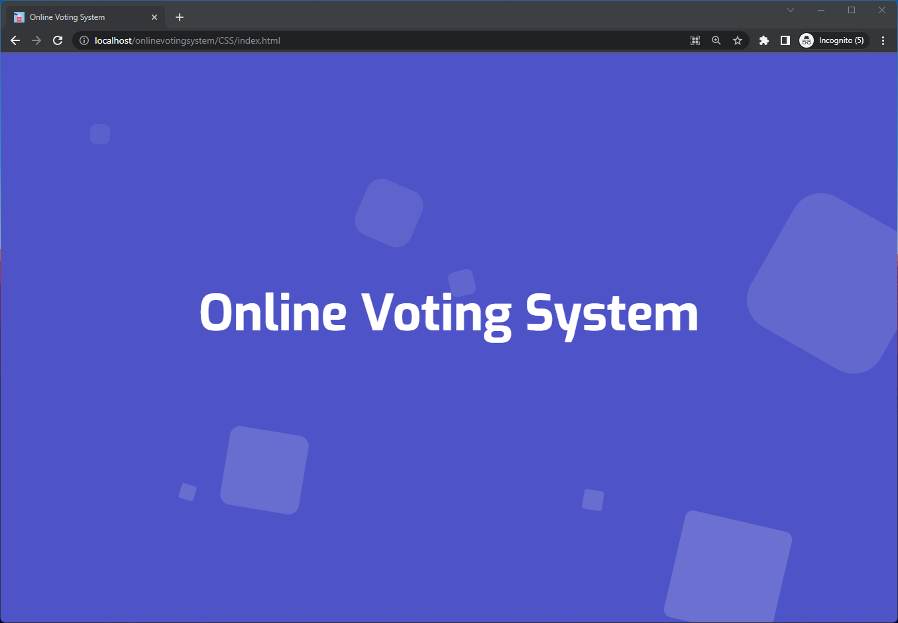

### ReadME

## Objective
The objective of this project is to develop an online voting website.

## Description 
In this project we have developed online voting system enabling voter to vote for their favourite candidate.

It is a simple e-Voting system that can be utlized for conducting voting for multiple positions. 
	

Operating System - Windows 11

Technologies : 
	
	- HTML (HyperText Markup Language)
	
	- CSS (Cascading Style Sheets)
	
	- PHP (Hypertext Preprocessor)
	
	- MySQL
	
	- XAMPP Server

# Contributors
1. Dhruv Saini  
     . LinkedIN - https://www.linkedin.com/in/dhruv73

    
     
# SQL Database
	1. Create a new Database 'Voting'.
	2. Create table User.
	3. Create table candidate.
